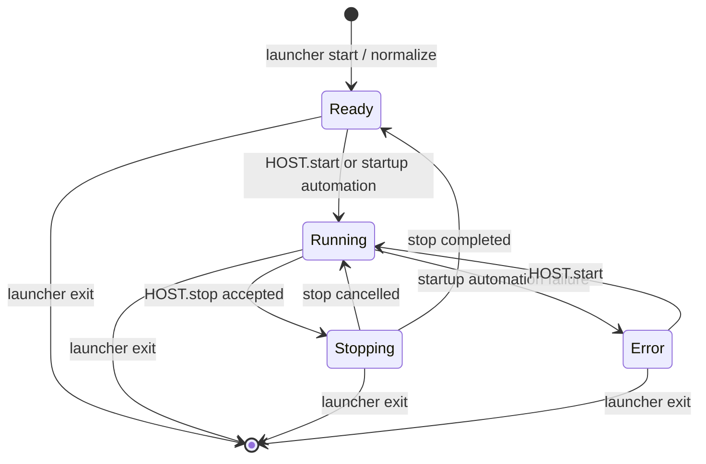

# Host Control Flow

This document describes the control-file protocol used by AutomationLauncher to manage startup automation and external host commands.

## Purpose

The launcher exposes a simple file-based control channel in its application directory. External systems can drop command files, and the launcher maintains state marker files that describe the current lifecycle state.

The protocol is intentionally split into two groups:

- Command files: one-shot signals consumed and deleted by the launcher.
- State files: persistent markers that describe the current launcher state.

## File Types

Command files:

- `HOST.start`
- `HOST.stop`
- `HOST.makearchive`

State files:

- `HOST.ready`
- `HOST.run`
- `HOST.stopping`
- `HOST.error`
- `HOST.archivecreated`

`HOST` means the current Windows machine name, for example `DESKTOP-S5T00FK.ready`.

## State Semantics

- `HOST.ready`: launcher is alive, monitoring the folder, and ready to accept commands.
- `HOST.run`: launcher entered managed runtime mode and startup automation completed successfully.
- `HOST.stopping`: stop command was accepted and the launcher is currently in the stop countdown or shutdown stage.
- `HOST.error`: launcher failed while entering managed runtime mode and ended in an error state.
- `HOST.archivecreated`: the last `HOST.makearchive` command completed successfully and produced an archive.

The launcher guarantees that only one state marker should exist at a time.

## Startup Normalization

When the launcher starts, it performs normalization:

1. Deletes stale command files `HOST.start` and `HOST.stop`.
2. Deletes stale state markers from a previous run.
3. Creates `HOST.ready`.
4. Starts the 3-second polling monitor.

This means the launcher always begins from a clean, deterministic state.

## Command Flow

### `HOST.start`

1. Polling detects `HOST.start`.
2. Launcher deletes `HOST.start` immediately.
3. If the launcher is already in `Running` or `Stopping`, the command is ignored.
4. Otherwise the launcher starts startup automation.
5. State changes from `Ready` or `Error` to `Running`.
6. If startup automation succeeds, `HOST.run` remains.
7. If startup automation is cancelled, tracked processes are stopped and the launcher returns to `HOST.ready`.
8. If startup automation fails, tracked processes are stopped and the launcher moves to `HOST.error`.

### `HOST.stop`

1. Polling detects `HOST.stop`.
2. Launcher deletes `HOST.stop` immediately.
3. If the launcher is not in `Running`, the command is ignored.
4. If the launcher is in `Running`, it changes state to `HOST.stopping`.
5. A stop splash screen is shown with a 60-second countdown and cancel option.
6. If stop is cancelled, state returns to `HOST.run`.
7. If stop is confirmed, tracked processes are stopped and state changes to `HOST.ready`.

### `HOST.makearchive`

1. Polling detects `HOST.makearchive`.
2. Launcher deletes `HOST.makearchive` immediately.
3. If the launcher is already busy, the command is ignored.
4. Otherwise the launcher starts the archive workflow.
5. Before the workflow starts, the launcher deletes any stale `HOST.archivecreated` marker.
6. If archive creation succeeds, the launcher writes `HOST.archivecreated`.
7. Host state does not change automatically because archive execution is an operational action, not a host state transition.

## Exit Behavior

When the launcher exits, it removes all host control files.

This is intentional: when the launcher process is not alive, it should not leave behind `ready`, `run`, `stopping`, or command files that would falsely suggest an active control channel.

## Polling

- Poll interval: every 3 seconds.
- Commands are consumed in this order:
  1. `HOST.start`
  2. `HOST.stop`
  3. `HOST.makearchive`

This ordering ensures that start/stop lifecycle commands are handled before archive commands if multiple files appear at the same time.

## Tray Context Menu

The tray context menu exposes direct manual actions that map to the same operational flows:

- `Run managed applications`
- `Stop managed applications`
- `Create archive now`

These actions use the same startup, stop, and archive logic as the file-based command flow.

## Tray Indicator Colors

- Green blinking: launcher is starting managed applications or running startup automation.
- Red blinking: launcher is stopping managed applications or showing the stop countdown.
- Blue blinking: launcher is currently creating an archive.

## State Diagram

## Practical Examples

Example 1: launcher idle and ready

- Present: `HOST.ready`
- Missing: `HOST.run`, `HOST.stopping`, `HOST.error`

Example 2: managed applications active

- Present: `HOST.run`
- Missing: `HOST.ready`, `HOST.stopping`, `HOST.error`

Example 3: stop countdown in progress

- Present: `HOST.stopping`
- Missing: `HOST.ready`, `HOST.run`, `HOST.error`

Example 4: startup automation failed

- Present: `HOST.error`
- Missing: `HOST.ready`, `HOST.run`, `HOST.stopping`

## Logging

The launcher logs:

- detection of `HOST.start` and `HOST.stop`
- detection of `HOST.makearchive`
- creation of state files
- deletion of command and state files
- creation of `HOST.archivecreated` after successful archive generation
- host state transitions with the reason

These entries allow full reconstruction of the control flow from the log file.